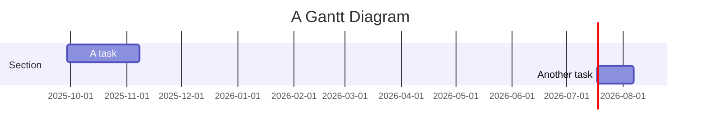

```chartsview
#-----------------#
#- chart type    -#
#-----------------#
type: Radar

#-----------------#
#- chart data    -#
#-----------------#
data:
  - item: "Communicatie"
    user: "Begin"
    score: 30
  - item: "Communicatie"
    user: "Nu"
    score: 70
  - item: "Samenwerken"
    user: "Begin"
    score: 45
  - item: "Samenwerken"
    user: "Nu"
    score: 75
  - item: "Zelfstandigheid"
    user: "Begin"
    score: 75
  - item: "Zelfstandigheid"
    user: "Nu"
    score: 90
  - item: "Probleemoplossend vermogen"
    user: "Begin"
    score: 45
  - item: "Probleemoplossend vermogen"
    user: "Nu"
    score: 70
  - item: "Planning & Organisatie"
    user: "Begin"
    score: 20
  - item: "Planning & Organisatie"
    user: "Nu"
    score: 85

#-----------------#
#- chart options -#
#-----------------#
options:
  xField: "item"
  yField: "score"
  seriesField: "user"
  meta:
    score:
      alias: "Score"
      min: 0
      nice: true
  xAxis:
    line: null
    tickLine: null
  yAxis:
    label: false
    grid:
      alternateColor: "rgba(0, 0, 0, 0.04)"
  point: {}
  area: {}

```





 [[Archive]] 
