```dataviewjs
(async () => {
    const pages = dv.pages();
    const data = [];

    for (const p of pages) {
        const content = await dv.io.load(p.file.path);
        const wordCount = (content.match(/\b\w+\b/g) || []).length;
        data.push({ name: p.file.name, words: wordCount });
    }

    const top = data.sort((a, b) => b.words - a.words).slice(0, 30);

    // maak een canvas element
    const canvas = this.container.createEl("canvas");

    // teken de chart met Chart.js
    new Chart(canvas.getContext("2d"), {
        type: "bar",
        data: {
            labels: top.map(d => d.name),
            datasets: [{
                label: "Word count",
                data: top.map(d => d.words),
                backgroundColor: "rgba(239, 136, 98, 0.7)" // mooi kleurtje
            }]
        },
        options: {
            indexAxis: "y", // horizontale bars (handiger met lange namen)
            plugins: {
                legend: { display: false }
            }
        }
    });
})();
```

```mermaid
flowchart TB
    %% Topniveau
    Gemeenteraad["Gemeenteraad"]
    B_W["College van B&W"]
    GS["Gemeentesecretaris"]

    GS --> B_W
    GS --> SSC["Shared Service Centrum"]
    GS --> SociaalDomein["Sociaal Domein"]
    GS --> FysiekDomein["Fysiek Domein"]
    GS --> Veiligheidsdomein["Veiligheidsdomein"]
    GS --> PubliekeDienstverlening["Burgerzaken & Service & Informatie"]
    GS --> Projectbureau["Projectbureau (PMB)"]
    GS --> HistorischCentrum["Historisch Centrum Leeuwarden"]

    %% Shared Service Centrum
    SSC --> Financien["Financiën, Administratie & Belastingen"]
    Financien --> FinTeam1["Team Financiën"]
    Financien --> AdmBelastingen["Team Administratie & Belastingen"]

    SSC --> ICT["ICT"]
    ICT --> ICTTeam1["Team Applicatiebeheer"]
    ICT --> ICTTeam2["Team Infrastructuur"]

    SSC --> IM["Informatiemanagement"]
    IM --> IMTeam1["Team Informatievoorziening"]
    IM --> IMTeam2["Team Data & Analyse"]

    SSC --> M_O["Mens & Organisatie"]
    M_O --> MOTeam1["Team HR"]
    M_O --> MOTeam2["Team Organisatieontwikkeling"]

    SSC --> Communicatie["Communicatie"]
    Communicatie --> ComTeam1["Team Interne Communicatie"]
    Communicatie --> ComTeam2["Team Externe Communicatie"]

    SSC --> Facilitair["Facilitair Beheer & Documentaire Informatie"]
    Facilitair --> FacTeam1["Team Facilitaire Diensten"]
    Facilitair --> FacTeam2["Team Documentaire Informatie"]

    SSC --> Concern["Concern"]
    Concern --> ConcernTeam1["Team Strategisch & Politiek Advies"]
    Concern --> ConcernTeam2["Team Bestuurlijke Ondersteuning"]

    %% Sociaal Domein
    SociaalDomein --> B_Advies["Bedrijfsvoering & Advies Sociaal Domein"]
    B_Advies --> BA_Team1["Team Advies"]
    B_Advies --> BA_Team2["Team Ondersteuning"]

    SociaalDomein --> BeleidStrategie["Beleid & Strategie Sociaal Domein"]
    BeleidStrategie --> BS_Team1["Team Beleid"]
    BeleidStrategie --> BS_Team2["Team Strategie"]
    BeleidStrategie --> BS_Team3["Team Contractmanagement"]

    SociaalDomein --> InkomenWMO["Inkomen & WMO"]
    InkomenWMO --> IWMO_Team1["Team Bijstand"]
    InkomenWMO --> IWMO_Team2["Team Uitkeringsonderhoud"]
    InkomenWMO --> IWMO_Team3["Team Participatiewet"]
    InkomenWMO --> IWMO_Team4["Team KCC"]

    SociaalDomein --> JeugdGezin["Jeugd & Gezin"]
    JeugdGezin --> JG_Team1["Team Jeugdhulp"]
    JeugdGezin --> JG_Team2["Team Advies & Begeleiding"]

    SociaalDomein --> WerkParticipatie["Werk & Participatie"]
    WerkParticipatie --> WP_Team1["Team Begeleiding"]
    WerkParticipatie --> WP_Team2["Team Coaching"]
    WerkParticipatie --> WP_Team3["Team Participatievoorzieningen"]

    %% Fysiek Domein
    FysiekDomein --> BB_VL["Bedrijfsbureau & Vergunningen & Leefomgeving"]
    BB_VL --> BB_Team1["Team Bedrijfsbureau"]
    BB_VL --> VL_Team2["Team Vergunningen & Leefomgeving"]

    FysiekDomein --> GES["Gebiedszaken, Economie & Strategie"]
    GES --> GES_Team1["Team Ruimtelijke Ontwikkeling"]
    GES --> GES_Team2["Team Economie"]
    GES --> GES_Team3["Team Strategische Staf"]

    FysiekDomein --> DuurzameOmgeving["Duurzame Omgevingskwaliteit"]
    DuurzameOmgeving --> DO_Team1["Team Omgevingskwaliteit"]

    FysiekDomein --> IBB["Inrichting & Beheer Buitenruimte"]
    IBB --> IBB_Team1["Team Openbare Ruimte"]
    IBB --> IBB_Team2["Team Ondergrondse Infrastructuur"]

    %% Veiligheidsdomein
    Veiligheidsdomein --> Handhaving["Handhaving Veiligheidsdomein"]
    Handhaving --> H_Team1["Team Toezicht"]
    Handhaving --> H_Team2["Team Handhaving"]

    Veiligheidsdomein --> JVZ["Juridische & Veiligheidszaken"]
    JVZ --> JVZ_Team1["Team Veiligheid"]
    JVZ --> JVZ_Team2["Team Juridische Zaken"]
    JVZ --> JVZ_Team3["Team Klachten & Bezwaar"]

```





